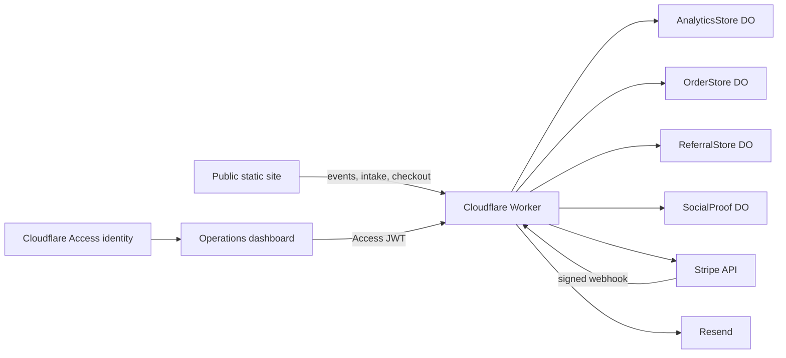

# Architecture

## System Map

## Ownership Boundaries

| Area | Owner | Source of truth |
| --- | --- | --- |
| Public presentation | Web | Root HTML, `styles.css`, `public/` |
| Intake UX | Web | `intake/index.html`, `spray-intake.js` |
| Order lifecycle | Payments | `worker/src/domain/order-state.js`, `OrderStore` |
| Operator identity | Security | Cloudflare Access, `worker/src/auth.js` |
| KPI definitions | Growth | `docs/metrics.md`, `AnalyticsStore` |
| Clinical decision | Licensed provider | Provider-review workflow and order audit |

## Request Flow

1. The customer submits the seven-step intake to `/provider-requests`.
2. The Worker stores the request server-side and returns an opaque request ID.
3. The browser retains only a short-lived payment receipt in `sessionStorage`; health answers are not persisted in the browser.
4. Stripe Checkout authorizes the card without capture.
5. A verified Stripe webhook creates the pending order.
6. A provider approves or denies through an Access-protected endpoint.
7. Approval captures once and creates the subscription. Denial releases the authorization.
8. Every lifecycle transition is validated and audited.

## Deliberate Constraints

- GitHub Pages remains the public origin; public HTML/CSS behavior is unchanged.
- Durable Objects remain the current data layer to avoid an unsafe data migration during the security refactor.
- The old Vercel and Supabase handlers are compatibility code, not the target architecture. Remove them only after production traffic and DNS logs confirm no callers.
- The dashboard is a read model, not a second source of truth.
